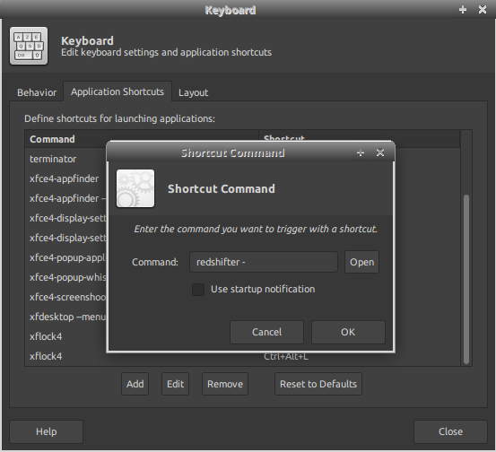

# redshifter

Redshifter is a simple script that you can use to adjust the color temperature of your desktop.  

It makes use of [Redshift](https://github.com/jonls/redshift), a popular open source program.

### What makes this tool different from redshift ?

[Redshift](https://github.com/jonls/redshift) is a utility which will help you change your desktop's color temperature based on your location automatically.  

However, in most cases, I like to control temperature myself. To do that, Redshift provides a way to set the temperature directly using `redshift -O <value>` command.  

Redshifter makes use of this command and lets you increment / decrement the values by certain factor. Redshifter could be configured to be executed with custom keyboard shortcut to allow you to change temperature the same way you change screen brightness. 

### Options

Increase blue hue on screen using

`redshifter +`

Decreases blue hue on screen using

`redshifter -`

### Custom keyboard shortcuts example

