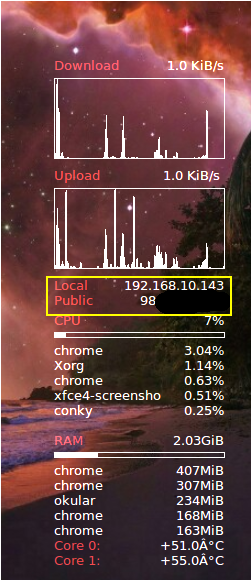

## whatsmyip

whatsmyip makes use of [free online api offered by whatsmyipaddress.com](https://whatismyipaddress.com/api) to print public IP address of the device.

It was developed to be used with [Conky](https://github.com/brndnmtthws/conky) widgets.  

Since this API has limits on usage, api calls are made in periodic intervals.  

### whatsmyip in a conky widget on Linux Mint desktop

### Example configuration for conky widget

`${color2}Public IP${color0}${alignr}${execi 8 bash <PATH_TO_WHATSMYIP_EXECUTABLE>}`

Visit this awesome project [Conky](https://github.com/brndnmtthws/conky) for more information on making your own desktop widgets   
